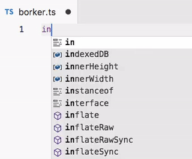

Zero Reference
==============

Highlight parts of code with no references in [Visual Studio Code](https://github.com/microsoft/vscode).

Preview
-------

Supported Languages
-------------------

* TypeScript
* JavaScript (note about [jsconfig.json](https://code.visualstudio.com/docs/languages/jsconfig))

Installation
------------

[How to install VSCode extensions](https://code.visualstudio.com/docs/editor/extension-gallery)

License
-------

MIT License © Roman Nuritdinov (Ky6uk)
